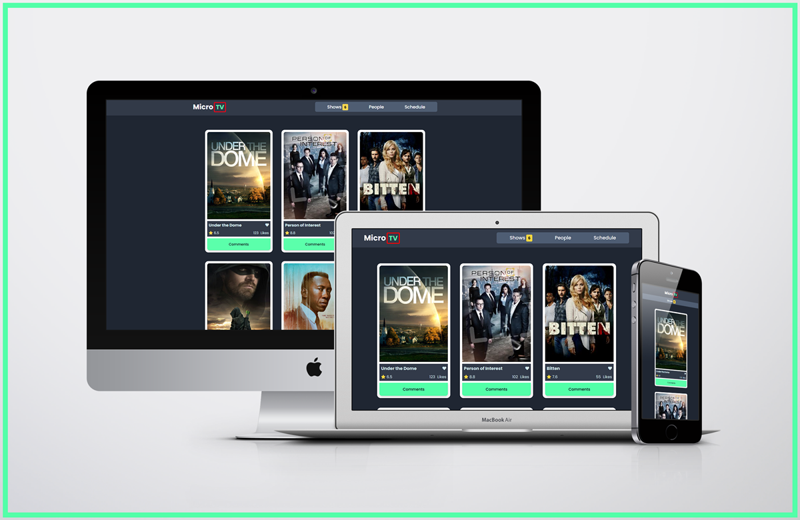

# Leaderboard

> This JavaScript project is about building a web application based on an external API. We built our page using data from the TVmaze API and the Involvement API.

## Screenshot



## Built With

- HTML
- CSS/SCSS
- JavaScript(ES6)
- Webpack
- API

## Live site 🚀

🔗 [Live Site Link](https://dewslyse.github.io/JS-capstone/)

## Getting Started

To get a local copy up and running follow this simple step:

- Clone repository to your local machine: `git@github.com:dewslyse/JS-capstone.git`
- `cd JS-capstone`
- Run `npm install` to install dependencies
- Run `npm start` to start app
- Run `npm run test` to perform unit tests.

## API information

### Involvement API

- The [Involvement API](https://www.notion.so/microverse/Involvement-API-869e60b5ad104603aa6db59e08150270) service was created by [Microvere](https://www.microverse.org/).

- **Base URL**: `https://us-central1-involvement-api.cloudfunctions.net/capstoneApi/`
- To generate a unique identifier, send a POST action to `Base URL` + `/apps/`. (No parameters required);

- Return value: unique identifier for the app
```
    Zl4d7IVkemOTTVg2fUdz
```

- To create a new like for a given item, send a POST action to `Base URL` + `/apps/` + `:id` + `/likes/`. E.g: `Base URL/apps/Zl4d7IVkemOTTVg2fUdz/likes/`. Example of request body:
```
{ 
   "item_id": "item1"
}
```

- To create a new comment for a given item, send a POST action to `Base URL` + `/apps/` + `:id` + `/comments/`. E.g: `Base URL/apps/Zl4d7IVkemOTTVg2fUdz/comments/`. Example of request body:
```
{
    "item_id": "item1",
    "username": "Jane",
    "comment": "Hello"
}
```
- You can use the GET method to get the list of items with their respective likes and comments.

### TVmaze API

- The [TVmaze API](https://www.tvmaze.com/api) provides data about TV series and movies. The API provides a number of endpoints from where shows data can be retrieved. This project used data from `https://api.tvmaze.com/shows/`.


## Authors

👤 **Cathy**

- GitHub: [@dewslyse](https://github.com/kemigabocatherine)

👤 **Selase**

- GitHub: [@dewslyse](https://github.com/dewslyse)


## 🤝 Contributing

Contributions, issues, and feature requests are welcome!

Feel free to check the [issues page](../../issues/).

## Show your support

Give a ⭐️ if you like this project!

## Acknowledgments

- Hat tip to anyone whose code was used
- Inspiration
- etc

## 📝 License

This project is [MIT](./LICENSE) licensed.
